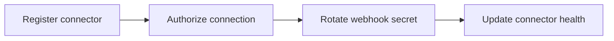

# Integration Core Developer Guide

**Maturity Tier:** `Hardened`

## Purpose And Architecture Role

`integration-core` is the governed connector control plane for the Gutu ecosystem. It turns external integrations into explicit platform records with authorization, webhook ingress, policy, and health state instead of leaving them as hidden runtime configuration.

## Repo Map

| Path | Purpose |
| --- | --- |
| `framework/builtin-plugins/integration-core` | Publishable plugin package. |
| `framework/builtin-plugins/integration-core/src` | Actions, resources, services, policies, and admin UI exports. |
| `framework/builtin-plugins/integration-core/tests` | Unit, contract, integration, and migration coverage. |
| `framework/builtin-plugins/integration-core/db/schema.ts` | Durable schema for connectors, connections, and webhooks. |
| `framework/builtin-plugins/integration-core/docs` | Internal supporting domain docs for connector governance. |

## Manifest Contract

| Field | Value |
| --- | --- |
| Package Name | `@plugins/integration-core` |
| Manifest ID | `integration-core` |
| Display Name | Integration Core |
| Kind | `plugin` |
| Trust Tier | `first-party` |
| Review Tier | `R1` |

## Dependency Graph And Capability Requests

| Field | Value |
| --- | --- |
| Depends On | `auth-core`, `org-tenant-core`, `role-policy-core`, `audit-core` |
| Requested Capabilities | `ui.register.admin`, `api.rest.mount`, `data.write.integrations` |
| Provides Capabilities | `integrations.connectors`, `integrations.connections`, `integrations.webhooks` |
| Owns Data | `integrations.connectors`, `integrations.connections`, `integrations.webhooks` |

## Public Integration Surfaces

| Type | ID | Notes |
| --- | --- | --- |
| Action | `integrations.connectors.register` | Registers or updates a governed connector definition. |
| Action | `integrations.connections.authorize` | Persists a tenant-scoped connection authorization state. |
| Action | `integrations.webhooks.rotate-secret` | Rotates a webhook secret and updates ingress state. |
| Resource | `integrations.connectors` | Connector catalog with transport and policy metadata. |
| Resource | `integrations.connections` | Authorized tenant-scoped connection records. |
| Resource | `integrations.webhooks` | Webhook ingress state, secret version, and health. |
| Builder | `integration-builder` | Connector authoring surface under `/admin/tools/integration-builder`. |

## Hooks, Events, And Orchestration

- No plugin-local hook bus is exported.
- The plugin surfaces connector state to `@platform/ai-mcp`, `ai-rag` knowledge pipelines, and Company Builder assignment flows.
- Webhook secret rotation is modeled as explicit state transition rather than a side effect hidden in runtime config.

## Storage, Schema, And Migration Notes

- Schema file: `framework/builtin-plugins/integration-core/db/schema.ts`
- Durable records cover connectors, authorized connections, and webhook ingress state.
- Seed data provides one connector, one connection, and one webhook path for regression coverage.

## Failure Modes And Recovery

- Unknown connector references fail before connection state is persisted.
- Secret rotation always writes a new secret version instead of mutating the record in place without traceability.
- Health reporting stays visible in the control plane even if a connector is not currently authorized.
- Cross-tenant connection changes are rejected by service filters and policy constraints.

## Mermaid Flows



## Integration Recipes

```ts
import {
  registerConnectorAction,
  rotateWebhookSecretAction,
  ConnectorResource,
  WebhookResource
} from "@plugins/integration-core";

console.log(registerConnectorAction.id);
console.log(rotateWebhookSecretAction.id);
console.log(ConnectorResource.id, WebhookResource.id);
```

## Test Matrix

- Root scripts: `bun run build`, `bun run typecheck`, `bun run lint`, `bun run test`, `bun run test:contracts`, `bun run test:integration`, `bun run test:migrations`, `bun run test:unit`, `bun run docs:check`
- Unit focus: connector registration, connection authorization, secret rotation
- Contract focus: integrations workspace, builder exposure, admin routes
- Integration focus: connector lifecycle and health visibility

## Current Truth And Recommended Next

- Current truth: `integration-core` owns the governed integration control plane, not the full transport implementation.
- Recommended next: add secret-vault adapters, quarantine flows, and richer webhook replay diagnostics.
